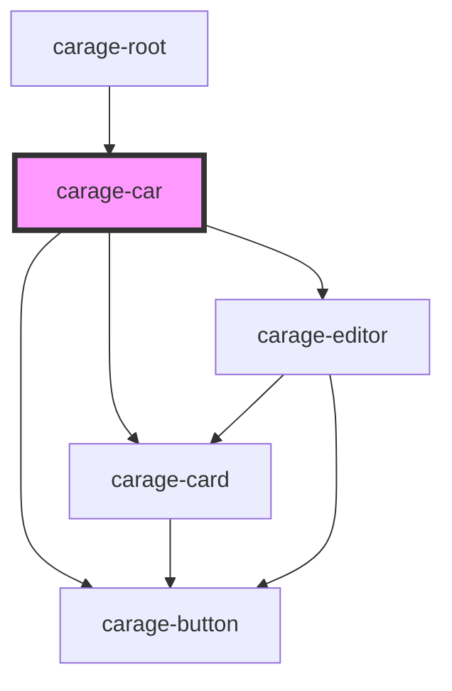

# carage-car-detail

<!-- Auto Generated Below -->

## Properties

| Property | Attribute | Description | Type       | Default     |
| -------- | --------- | ----------- | ---------- | ----------- |
| `model`  | --        |             | `CarModel` | `undefined` |

## Dependencies

### Used by

 - [carage-root](../../layout/root)

### Depends on

- [carage-card](../../ui/card)
- [carage-button](../../ui/button)
- [carage-editor](../editor)

### Graph

----------------------------------------------

*Built with [StencilJS](https://stenciljs.com/)*
