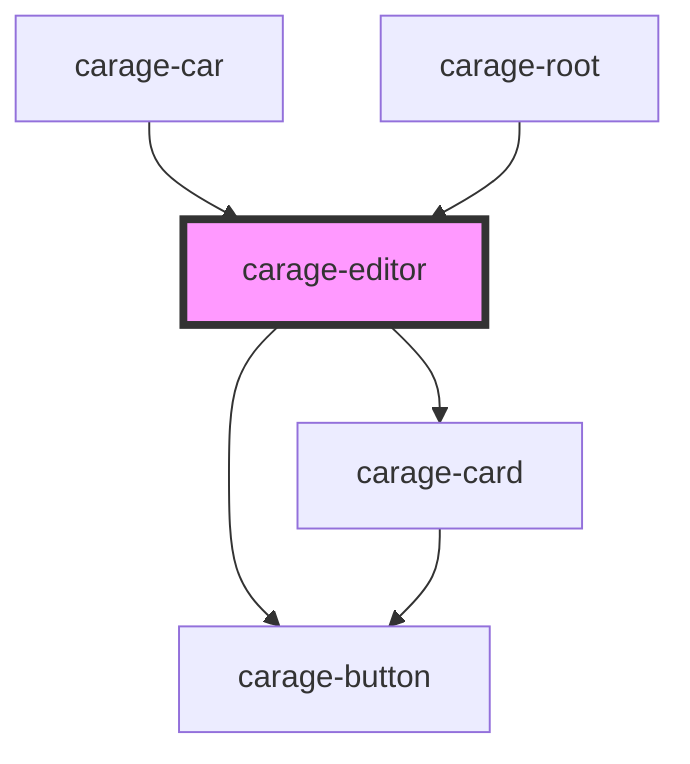

# carage-car-create

<!-- Auto Generated Below -->

## Properties

| Property | Attribute | Description | Type         | Default     |
| -------- | --------- | ----------- | ------------ | ----------- |
| `model`  | --        |             | `Model<any>` | `undefined` |

## Events

| Event   | Description | Type                      |
| ------- | ----------- | ------------------------- |
| `close` |             | `CustomEvent<void>`       |
| `save`  |             | `CustomEvent<Model<any>>` |

## Dependencies

### Used by

 - [carage-car](../car)
 - [carage-root](../../layout/root)

### Depends on

- [carage-card](../../ui/card)
- [carage-button](../../ui/button)

### Graph

----------------------------------------------

*Built with [StencilJS](https://stenciljs.com/)*
