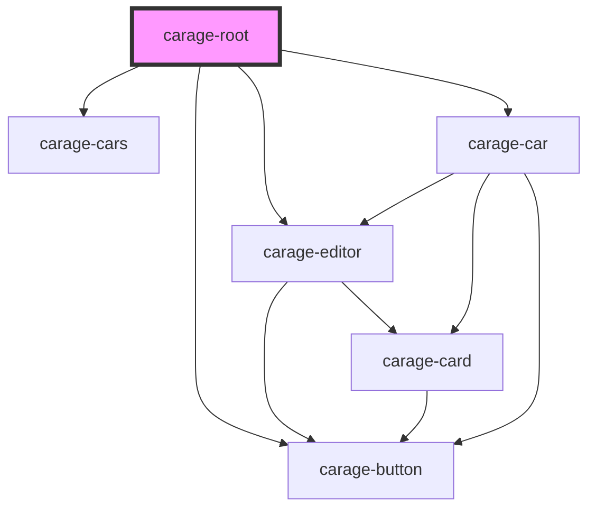

# carage-root

<!-- Auto Generated Below -->

## Dependencies

### Depends on

- [carage-editor](../../features/editor)
- [carage-cars](../../features/cars)
- [carage-car](../../features/car)
- [carage-button](../../ui/button)

### Graph

----------------------------------------------

*Built with [StencilJS](https://stenciljs.com/)*
