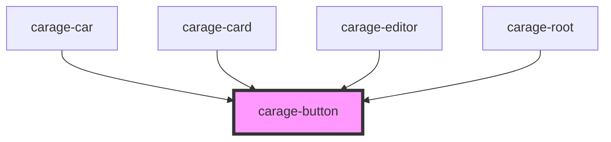

# carage-button

<!-- Auto Generated Below -->

## Properties

| Property | Attribute | Description | Type      | Default |
| -------- | --------- | ----------- | --------- | ------- |
| `expand` | `expand`  |             | `boolean` | `false` |

## Dependencies

### Used by

 - [carage-car](../../features/car)
 - [carage-card](../card)
 - [carage-editor](../../features/editor)
 - [carage-root](../../layout/root)

### Graph

----------------------------------------------

*Built with [StencilJS](https://stenciljs.com/)*
